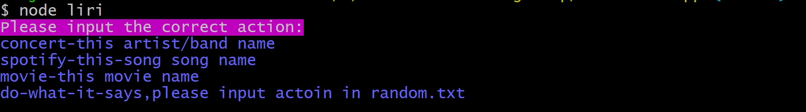
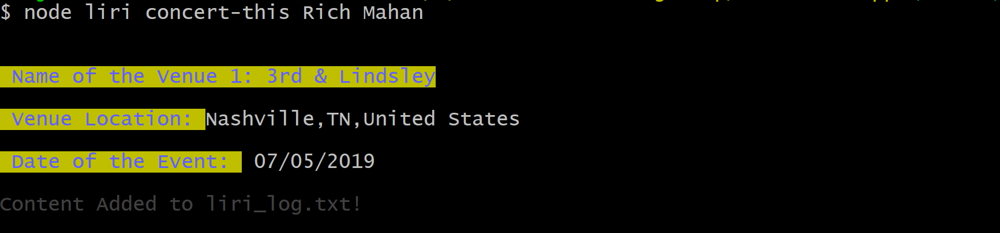
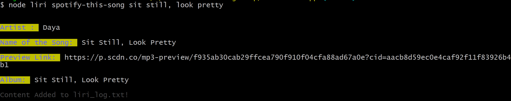
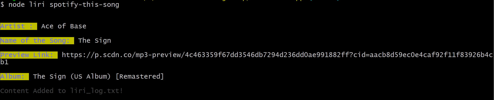
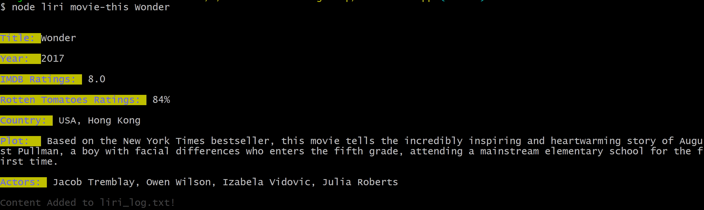
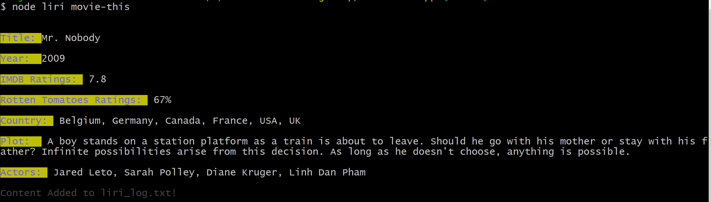
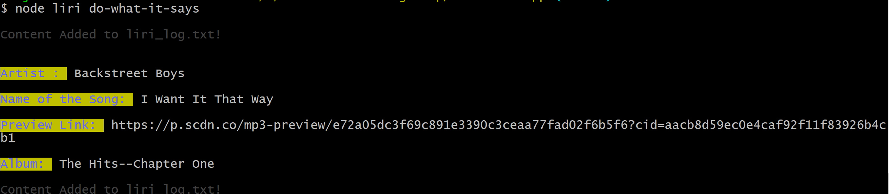

# liri-node-app

### Overview

 LIRI is like iPhone's SIRI. However, while SIRI is a Speech Interpretation and Recognition Interface, LIRI is a _Language_ Interpretation and Recognition Interface. LIRI will be a command line node app that takes in parameters and gives user back data.

### App Link
https://github.com/helenhao888/liri-node-app.git

### Developer
    Developed by Helen Hao (helenhao888)
    
### Technologies
    Node.js 
    javascript
    AXIOS package
    fs package
    moment package
    chalk package
    SPOTIFY, OMDB and bands in town API

### Program Structure
  *  liri.js         main javascript program
  *  key.js          Only process the key's env arguments
  *  .env file:      User needs to create his own .env file to store the SPOTIFY API key,                    Omdb   key  and bans in town api key.
  *  liri_log file:  It's an output log file to store all the activities.

 ### Instructions
 liri.js can take in one of the following commands:

   * `concert-this`

   * `spotify-this-song`

   * `movie-this`

   * `do-what-it-says`

1. `node liri.js concert-this <artist/band name here>`

   * This will search the Bands in Town Artist Events API  for an artist and render the following information about each event to the terminal.
2. `node liri.js spotify-this-song '<song name here>'`

   * This will show the following information about the song in the terminal/bash window

     * Artist(s) 

     * The song's name

     * A preview link of the song from Spotify

     * The album that the song is from

   * If no song is provided then the program will default to "The Sign" by Ace of Base.
   
3. `node liri.js movie-this '<movie name here>'`

   * This will output the following information to the terminal/bash window:

     ```
       * Title of the movie.
       * Year the movie came out.
       * IMDB Rating of the movie.
       * Rotten Tomatoes Rating of the movie.
       * Country where the movie was produced.
       * Language of the movie.
       * Plot of the movie.
       * Actors in the movie.
     ```

   * If the user doesn't type a movie in, the program will output data for the movie 'Mr. Nobody.'
 4. `node liri.js do-what-it-says`

   * Using the `fs` Node package, LIRI will take the text inside of random.txt and then use it to call one of LIRI's commands.
 5. If user only inputs `node liri.js `, it will give the command instructions. 


* In addition, all the actions will be loged to the file called `liri_log.txt`.

### screenshots of the app functioning

 1. `node lir`
 

 2. `node liri concert-this Rich Mahan`
 

 3. `node liri concert-this Rich Mahan`
 If input the wrong artist name
 

 4. `node liri spotify-this-song sit still, look pretty`
 
 
 5. `node liri spotify-this-song sit still, look`
 If input the wrong song name
 

 6. `node liri spotify-this-song`
 If don't input song name, it displays the default song "The Sign"
 

 7. `node liri movie-this Wonder`
 

 8. `node liri movie-this`
 If don't input movie name, it displays the default movie "Mr. Nobody"
 

 9. `node liri movie-this test name`
 If input an inexistent movie name, it displays the error
 
 
 10. `node liri do-what-it-syas`
 Do what it says in random.txt
 